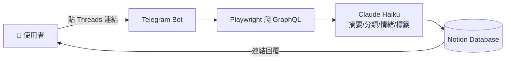
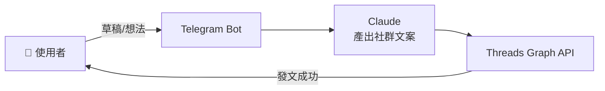

# Telegram Bot 工作流套件：自動化收藏 + AI 社群發文

這是一個為個人生產力打造的自動化系統。整合了 **Telegram** 作為入口，利用 **Claude AI** 進行分析與文案生成，並將資料流轉至 **Notion** 歸檔與 **Threads** 自動發布。

## 🚀 核心功能
* **智能收藏 (Collector):** 透過 Telegram 分享連結或截圖，系統自動分析內容並標籤化存入 Notion。
* **AI 創作發布 (Publisher):** 傳送簡單草稿，由 AI 生成社群風格文案並一鍵同步至 Threads（持續擴充中）。

## 🛠️ 技術棧
* **Language:** Python 3.12
* **Framework:** Flask (Webhook 接收)
* **AI Engine:** Claude API (Anthropic)
* **Integrations:** Notion API, Threads Graph API, Telegram Bot API
* **Infrastructure:** ngrok (Local Debug), Railway (Upcoming)

## 🗺️ 系統流程

### Collector（收藏流）


### Publisher（發文流）


## 📦 專案架構

### `threads-bot/` — Data Hoarder（多平台收藏 → Notion）

> 📦 資料夾還叫 `threads-bot/`（歷史包袱），實際用途是「多平台收藏 bot」，故對外暱稱 **Data Hoarder**。資料夾改名要協調 Railway Root Directory，已記在 [TODO.md](TODO.md) 之後再做。

傳任何網址或文字給 Telegram bot，自動爬內容（Playwright）→ Claude 分析（摘要／分類／情緒／標籤）→ 寫入 Notion Database。

**支援來源**：
- **Threads**（自家 + 別人公開貼文）— 走專用 GraphQL / `data-sjs` script tag 解析
- **Instagram / Facebook / YouTube / Medium / X / 任何網頁** — 走 `_scrape_generic`，抓 `<meta>` Open Graph + 主要文字
- **純文字筆記** — 直接傳一段話也可，當靈感卡片存
- **多筆混合** — 一則訊息塞多個連結 + 一段文字，bot 一次處理完

**指令**：
- `/start` — 開機問候
- `/stats` — 看 Notion 收藏數
- `/recent` — 最近 5 筆
- `/usage` — 查 Railway 本月用量 + 餘額
- `/sync threads [N|all]` — 從 Threads 收藏夾批次抓新貼文（預設 5、`all` 全跑）

**自動同步（選用）**：設 `AUTO_SYNC_HOURS=6` 後，bot 每 6 小時自己掃 Threads 收藏夾，找新的自動處理 — 連手動分享都不用了。

> Threads 在 2025 後期改成 server-side render + 未登入空殼，要爬完整資料需要登入 cookie，請見 `threads-bot/CLAUDE.md` 的 `THREADS_STATE_JSON` 設定。

### `xiaofa-bot/` — 小發自動發文
- `bot.py` — 把任意文字／網址訊息丟進 Telegram，Claude 整理後寫進 Notion。
- `xiaofa_bot.py` — 透過 Threads Graph API 直接發文到自己的 Threads。
- `v2/` — 用 Render 部署（webhook 版）的版本，含 iOS 捷徑說明。

## 使用前

兩個專案各自 `cp .env.example .env` 後填入金鑰，然後 `pip install -r requirements.txt`。
詳細步驟看各子目錄的 README / CLAUDE.md / 部署文件。

## 📝 想看實作筆記？

- [JOURNEY.md](JOURNEY.md) — 這個專案怎麼從「亂寫的 bot」長成這樣，每個轉折我在想什麼
- [LESSONS.md](LESSONS.md) — 客觀技術筆記（secret 管理、爬蟲、雲端部署、防呆）
- [TODO.md](TODO.md) — 還沒做的改進跟想法

## 🔐 安全

- `.env` 已被 `.gitignore` 排除。
- 本 repo 設有 [gitleaks](https://github.com/gitleaks/gitleaks) pre-commit hook 自動掃描 staged 檔案，攔截寫死的 API Key／Token。
  本機啟用方式：
  ```bash
  pip install pre-commit
  pre-commit install
  ```
- 建議用秘密管理服務（例：[Infisical](https://infisical.com/)）取代 `.env` 檔，金鑰永不落地。
