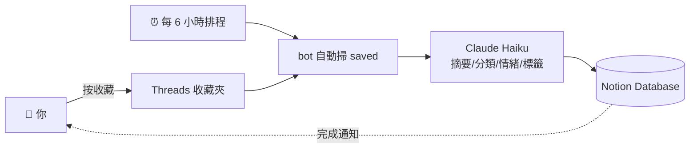
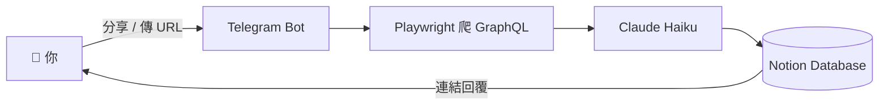

# Data Hoarder — Telegram Bot 自動收藏到 Notion

> 🦝 **核心賣點：全自動。** 你在 Threads「按收藏」的貼文 → bot 每 6 小時自動爬下來 → Claude AI 整理成 Notion 卡片（摘要 / 分類 / 情緒 / 標籤 / 圖片）。**你只要按收藏，剩下都自動。**

整合 **Telegram** 作為入口、**Claude AI** 做分析、**Notion** 做收納。為自己一個人的生產力打造，但 code、文件、踩坑歷程全公開。

## 🚀 核心功能
* **🤖 全自動同步**（最大賣點）：bot 排程定期掃你 Threads 收藏夾，找新貼文自動爬 + AI 分析 + 進 Notion，**完全不用手動觸發**。
* **📥 手動 / 分享觸發**：傳 URL 給 bot、用 iOS 分享、或呼叫 HTTP webhook，3 種方式都能進 Notion。
* **🎯 多平台支援**：Threads / Instagram / Facebook / YouTube / Medium / 任何網頁、純文字筆記。
* **🚀 AI 自動發文** — 開發中（會把 Notion 想法 / 草稿 → Claude 文案 → 自動發到 Threads）。

## 🛠️ 技術棧
* **Language:** Python 3.12
* **AI Engine:** Claude API (Anthropic Haiku)
* **Integrations:** Notion API, Telegram Bot API, Playwright
* **Infrastructure:** Railway (24/7 部署), Infisical (secret 管理)

## 🗺️ 系統流程

### 🤖 全自動模式（推薦，零按鍵）


### 📥 手動模式（分享或傳訊）


## 📦 專案架構

### `threads-bot/` — Data Hoarder（多平台收藏 → Notion）

> 📦 資料夾還叫 `threads-bot/`（歷史包袱），實際用途是「多平台收藏 bot」，故對外暱稱 **Data Hoarder**。資料夾改名要協調 Railway Root Directory，已記在 [TODO.md](TODO.md) 之後再做。

傳任何網址或文字給 Telegram bot，自動爬內容（Playwright）→ Claude 分析（摘要／分類／情緒／標籤）→ 寫入 Notion Database。

**支援來源**：
- **Threads**（自家 + 別人公開貼文）— 走專用 GraphQL / `data-sjs` script tag 解析
- **Instagram / Facebook / YouTube / Medium / X / 任何網頁** — 走 `_scrape_generic`，抓 `<meta>` Open Graph + 主要文字
- **純文字筆記** — 直接傳一段話也可，當靈感卡片存
- **多筆混合** — 一則訊息塞多個連結 + 一段文字，bot 一次處理完

**🤖 全自動同步（核心功能）**：設 `AUTO_SYNC_HOURS=6` 後，bot 每 6 小時自己掃 Threads 收藏夾，找新的貼文自動處理進 Notion — **連手動分享都不用了**。

**指令**：
- `/sync threads [N|all]` — 手動跑一次同步收藏夾（自動模式之外，想立刻同步用）
- `/start` — 開機問候
- `/stats` — 看 Notion 收藏數
- `/recent` — 最近 5 筆
- `/usage` — 查 Railway 本月用量 + 餘額

> Threads 在 2025 後期改成 server-side render + 未登入空殼，要爬完整資料需要登入 cookie，請見 `threads-bot/CLAUDE.md` 的 `THREADS_STATE_JSON` 設定。

### `xiaofa-bot/` — 自動發文（開發中）
把 Notion 裡的想法、草稿透過 Claude 整理 → 自動發到 Threads。**目前還在開發中**，不是 production-ready，code 留著之後接回主流程。

## 使用前

兩個專案各自 `cp .env.example .env` 後填入金鑰，然後 `pip install -r requirements.txt`。
詳細步驟看各子目錄的 README / CLAUDE.md / 部署文件。

## 📝 想看實作筆記？

- [JOURNEY.md](JOURNEY.md) — 這個專案怎麼從「亂寫的 bot」長成這樣，每個轉折我在想什麼
- [LESSONS.md](LESSONS.md) — 客觀技術筆記（secret 管理、爬蟲、雲端部署、防呆）
- [TODO.md](TODO.md) — 還沒做的改進跟想法

## 🔐 安全

- `.env` 已被 `.gitignore` 排除。
- 本 repo 設有 [gitleaks](https://github.com/gitleaks/gitleaks) pre-commit hook 自動掃描 staged 檔案，攔截寫死的 API Key／Token。
  本機啟用方式：
  ```bash
  pip install pre-commit
  pre-commit install
  ```
- 建議用秘密管理服務（例：[Infisical](https://infisical.com/)）取代 `.env` 檔，金鑰永不落地。
